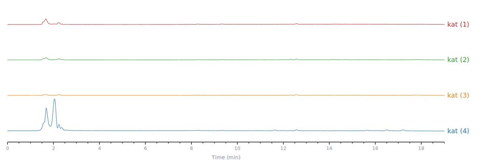

<p align="center">
  <a href="README.md">English</a> &middot;
  <a href="https://hplc-data-visualizer.streamlit.app/">在线 Demo</a> &middot;
  <a href="https://github.com/himsang5ms/HPLC-Data-Visualizer/releases/latest">Windows 版下载</a> &middot;
  <a href="CASE_STUDY.md">Case Study</a> &middot;
  <a href="#截图">截图</a> &middot;
  <a href="#源码运行">源码运行</a>
</p>

<h1 align="center">HPLC Data Visualizer</h1>

<p align="center">
  面向实验室汇报和科研讨论的浏览器端 HPLC 色谱图快速绘图工具。
</p>

<p align="center">
  
  
  
  
</p>

## 项目简介

HPLC Data Visualizer 是一个面向药学、天然产物及相关实验室场景的 HPLC 色谱图绘制工具。它把原本需要在 Origin 等桌面软件里反复完成的导入数据、调整坐标轴、修改线条样式和导出图片等步骤，集中到了一个浏览器界面里，帮助你快速查看 HPLC 色谱图、比较多个样品，并输出风格统一、适合组会和科研讨论的图片。

## 核心功能

- 在浏览器中上传多个 HPLC 数据文件并绘制色谱图。
- 提供 Windows x64 便携版，无需另行安装 Python。
- 当前支持通用 `.csv` 文件和日立 `.ctx` 文件。
- 可以直接加载内置示例数据。
- 可以下载示例 CSV 压缩包，用于测试上传流程。
- 支持多样品瀑布图堆叠，方便进行样品间比较。
- 支持在侧边栏调整样品显示顺序。
- 支持切换内置配色模板，适配不同展示场景。
- 支持调整线宽、堆叠间距、X 轴显示范围和样品名字号。
- 支持将样品名显示在每条曲线的左侧或右侧。
- 支持隐藏图例和 Y 轴，让汇报图更简洁。
- 支持点击曲线标记保留时间。
- 支持框选峰区域并进行高亮显示。
- 支持通过显眼按钮或 Plotly 工具栏导出 SVG 矢量图。
- 支持中日英界面切换。

## Demo

在线 Demo：

https://hplc-data-visualizer.streamlit.app/

## Windows 便携版

最新的 Windows x64 便携版可前往 [GitHub Releases](https://github.com/himsang5ms/HPLC-Data-Visualizer/releases/latest) 下载。

下载后完整解压 ZIP，双击 `HPLC Data Visualizer.exe` 即可运行，无需另行安装 Python。

## 截图

SVG 导出示例：



## 使用流程

1. 打开在线 Demo 或 Windows 便携版。
2. 上传一个或多个 HPLC 数据文件，或直接加载内置示例数据。
3. 在侧边栏调整堆叠、配色、线宽、样品名、坐标轴和显示范围。
4. 根据需要标记保留时间或高亮峰区域。
5. 导出 SVG 图，用于汇报、组会或报告材料。

## 使用情况

该项目已在我所在的研究实验室中被频繁使用，且由该工具生成的图已经用于组会和科研汇报。

目前得到的反馈都比较积极，主要集中在几个实际价值上：减少重复排版、节省绘图时间，以及让多样品 HPLC 色谱图更容易整理和比较。

更详细的项目背景、产品决策和开发过程见英文 [Case Study](CASE_STUDY.md)。

## 技术栈

- Python
- Streamlit
- pandas
- Plotly
- PyInstaller（Windows 便携版打包）
- CSV / CTX 数据解析
- 浏览器端 SVG 导出

## Roadmap

计划或可能的后续改进：

- 支持更多仪器厂商的 HPLC 导出格式。
- 增强数据校验和解析错误提示。
- 改进峰面积积分流程和峰信息导出。
- 支持保存项目或会话，方便重复整理。
- 探索面向课题组或小型实验室的产品化版本。

## 源码运行

安装依赖：

```bash
pip install -r requirements.txt
```

运行应用：

```bash
streamlit run web_app.py
```

然后打开终端中显示的本地 Streamlit 地址。

## License

MIT License

## Contact

如有问题、bug 或建议，请使用 GitHub Issues。
